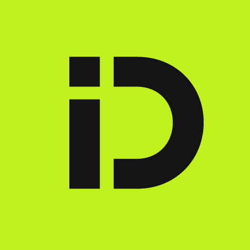

# inDrive Car Inspector 

Инструкция по запуску:
1) Установить все необходимые библиотеки, скачать веса YOLO(best.pt)
2) Запустить файл qwen_vlm_setup.ipynb
3) Запустить carcheck_api.py
4) Запустить frontend_api.py

Требования для YOLO:
https://docs.ultralytics.com/help/FAQ/#how-can-i-train-a-custom-yolo-model-on-my-own-dataset
Требования для Qwen:
https://huggingface.co/Qwen/Qwen2-VL-2B-Instruct
Библиотеки:
Pytorch, Ultralytics, PIL, opencv, FastAPI, Transformers, pandas, matplotlib, numpy. 
